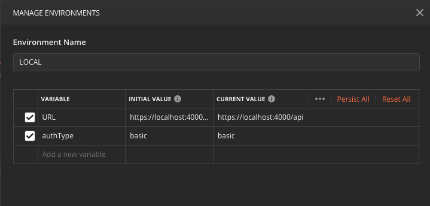

# Postman Tools
Settings and code to make the most of Postman.

## Auto-Authentication Setup
1. Create all the environments you need. These can be named anything you see fit

2. These environments only need two variables
    - URL
    - authType (must be one of the following):
        - bearer
        - basic

3. Add the 'URL' variable to the url of all your requests

4. Create a top level collection to hold all of the APIs you want to use auto-authentication

5. Edit the collection and add the following variables in the `Variables` tab. Note the names matter here since they are referenced in the script. Also make sure that the `Current Value` column is filled in since this is what the script uses.
    - bearerToken (Can be left blank)
    - tokenExpirationDate (Can be left blank)
    - clientId (oauth2 client Id)
    - clientSecret (oauth2 client secret)
    - username (basic auth username)
    - password (basic auth password)

6. Copy 'authentication-pre-request.js' and paste it in the 'Pre-request Scripts' tab

7. Make sure 'Authorization' for all of your requests are set to 'No Auth'. The pre-request script will handle this setting. The easiest way to do this is to set the top level collection to 'No Auth' and leave all others at their default value of 'Inherit auth from parent'.

8. Make a request! Check the Postman console if errors occur.
